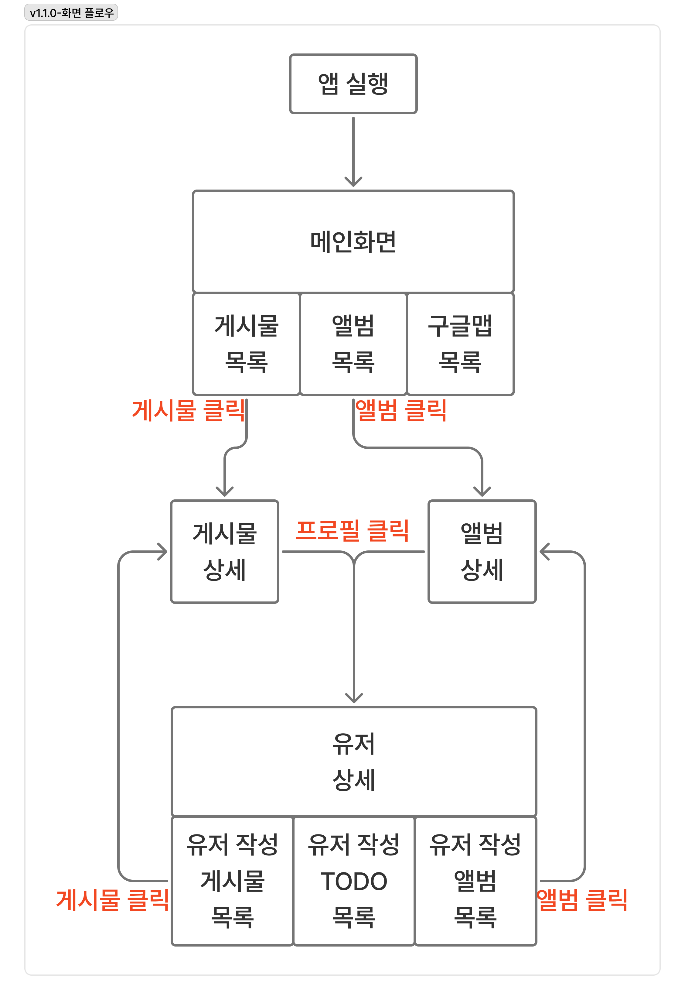

# Now-In-My-Android

> 지금 나의 안드로이드는? 

**Version: 1.1.0**

## 📖 프로젝트 소개

**Now-In-My-Android**는 현대적인 Android 개발 스택을 학습하고 실습하기 위한 지속적으로 발전하는 프로젝트입니다.

Google의 [Now in Android](https://github.com/android/nowinandroid) 프로젝트에서 영감을 받아, 최신 Android 개발 트렌드와 아키텍처 패턴을 적용하고 있습니다. JSONPlaceholder API를 활용한 기본 기능부터 시작하여, **Google Maps**, **카메라**, **알림**, **데이터베이스** 등 다양한 Android 기능들을 단계적으로 추가하며 학습하고 있습니다.

이 프로젝트는 단순한 샘플 앱이 아닌, **실제 개발 과정에서 마주하는 다양한 기술 스택과 패턴을 실험하고 학습하는 플레이그라운드**입니다.

## ✨ 주요 기능

### 📝 Post (게시글)
- 게시글 목록 조회
- 게시글 상세 정보 확인
- 게시글 작성자 정보 표시

### 📷 Album (앨범)
- 앨범 목록 조회
- 앨범 상세 정보 및 사진 목록
- 앨범 작성자 정보 표시

### 👤 User (사용자)
- 사용자 프로필 정보
- 사용자별 게시글 목록
- 사용자별 앨범 목록
- 사용자별 할 일(Todo) 목록

### 🗺️ Maps (지도)
- Google Maps 연동
- 주변 장소 조회 (Google Places API)
- 위치 기반 서비스

## 🎨 화면 흐름

앱의 전체 화면 흐름은 다음 이미지를 참고하세요:



## 🏗️ 아키텍처

### 모듈 구조
프로젝트는 멀티모듈 구조로 설계되어 관심사의 분리와 재사용성을 극대화했습니다.

```
NowInMyAndroid/
├── app/                          # 메인 애플리케이션 모듈
│   ├── navigation/               # 앱 전체 네비게이션
│   └── ui/theme/                 # 테마 및 디자인 시스템
├── core/                         # 핵심 공통 모듈
│   ├── core/                     # 유틸리티 및 공통 기능
│   │   ├── stateful/             # 상태 관리 유틸리티
│   │   └── flow/                 # Flow 확장 함수
│   └── network/                  # 네트워크 공통 설정
│       └── Retrofit 설정         # Retrofit + kotlinx.serialization
└── feat/                         # 기능별 모듈
    ├── json-placeholder/         # JSONPlaceholder 기능
    │   ├── post/                 # 게시글 기능
    │   │   ├── data/             # 데이터 레이어
    │   │   ├── domain/           # 도메인 레이어
    │   │   └── presentation/     # UI 레이어
    │   ├── album/                # 앨범 기능
    │   │   ├── data/
    │   │   ├── domain/
    │   │   └── presentation/
    │   ├── user/                 # 사용자 기능
    │   │   ├── data/
    │   │   ├── domain/
    │   │   └── presentation/
    │   └── _core/                # 공통 UI 컴포넌트
    │       └── ui/
    └── maps/                     # 지도 기능
        └── google_map/           # Google Maps 기능
            ├── data/             # 데이터 레이어
            ├── domain/           # 도메인 레이어
            └── presentation/     # UI 레이어
```

### 아키텍처 패턴
- **Clean Architecture**
- **MVI Pattern** 
- **MVVM Pattern** 
- **Repository Pattern**
- **Multi-Module Architecture**

## 🛠️ 기술 스택

### UI/UX
- **Jetpack Compose**
- **Material 3**
- **Compose Navigation**
- **Coil**

### Architecture & DI
- **Hilt**
- **ViewModel**
- **Kotlin Coroutines**
- **StateFlow/SharedFlow**

### Network
- **Retrofit**
- **kotlinx.serialization**
- **OkHttp**

### Maps & Location
- **Google Maps SDK**
- **Google Places API**
- **Location Services**

## 📂 주요 파일 구조

### App 모듈
- `MainActivity.kt`: 메인 액티비티 (Hilt 진입점)
- `AppNavHost.kt`: 앱 전체 네비게이션 그래프
- `App.kt`: Application 클래스

### Core 모듈
- `core:core`: 앱의 코어 기능
- `core:network`: Retrofit 설정 및 네트워크 기본 설정

### Feature 모듈
- **json-placeholder**
  - **Post**: 게시글 목록/상세, 작성/수정 기능
  - **Album**: 앨범 목록/상세, 사진 목록 기능
  - **User**: 사용자 프로필, 게시글/앨범/할일 탭 기능
  - **_core**: 공통 UI 컴포넌트 (TopBar, AuthorComponent, StatefulContent 등)
- **maps**
  - **Google Maps**: 지도 표시, 장소 조회, 위치 기반 서비스


### 데이터 상태 관리
```kotlin
// Stateful 패턴을 활용한 상태 관리
sealed interface Stateful<out T> {
    data object Loading : Stateful<Nothing>
    data class Error(val throwable: Throwable) : Stateful<Nothing>
    data class Success<T>(val data: T) : Stateful<T>
}
```

## 🌐 API 정보

### JSONPlaceholder API
**Base URL**: `https://jsonplaceholder.typicode.com/`

다음 엔드포인트를 활용합니다:
- `/posts`: 게시글 데이터
- `/albums`: 앨범 데이터
- `/photos`: 사진 데이터
- `/users`: 사용자 데이터
- `/todos`: 할 일 데이터

### Google Places API
**Base URL**: `https://maps.googleapis.com/maps/api/place/`

지도 및 장소 정보를 제공합니다:
- `places api`: 장소의 상세 정보, 이미지 조회 
- 위치 기반 장소 정보